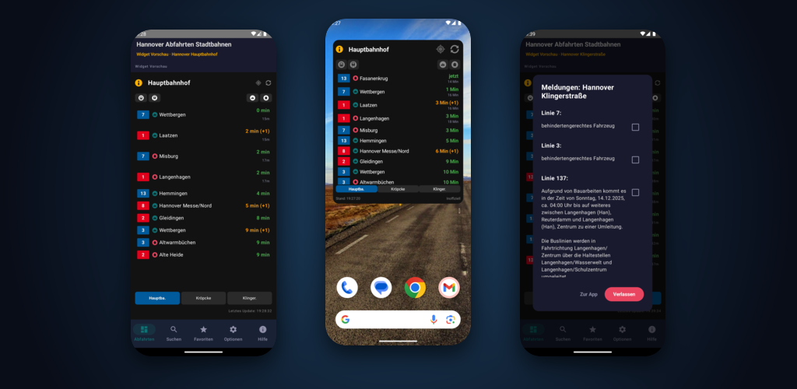
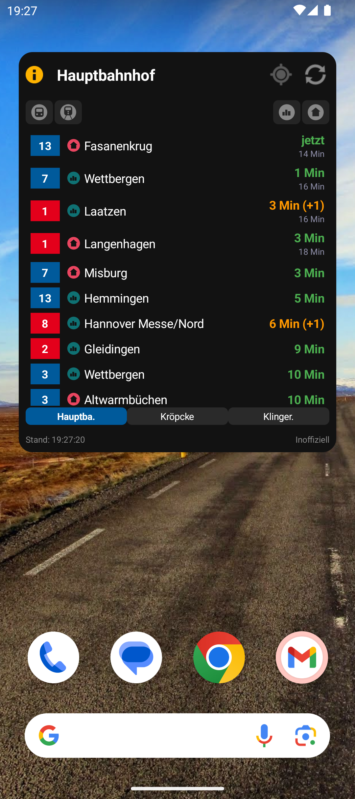
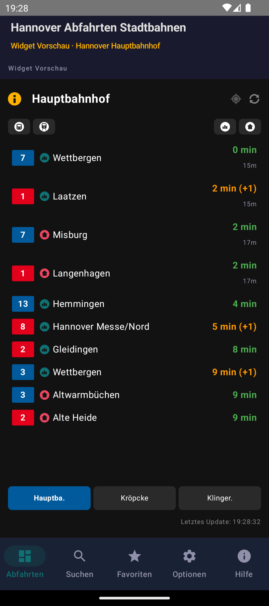
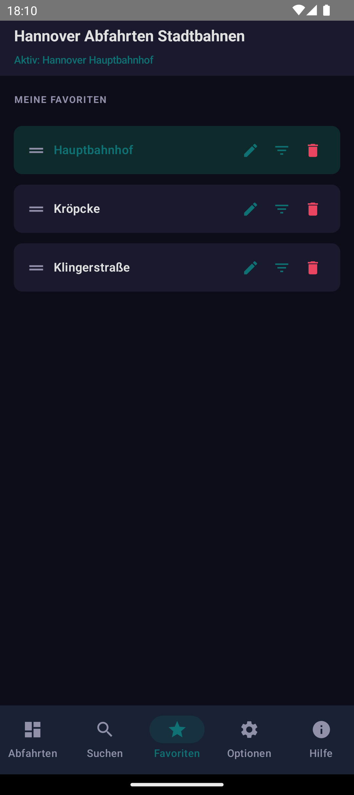
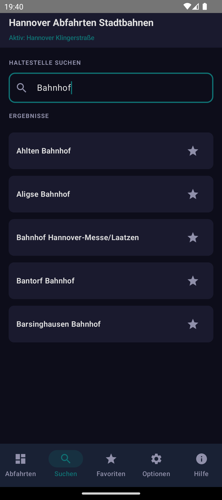
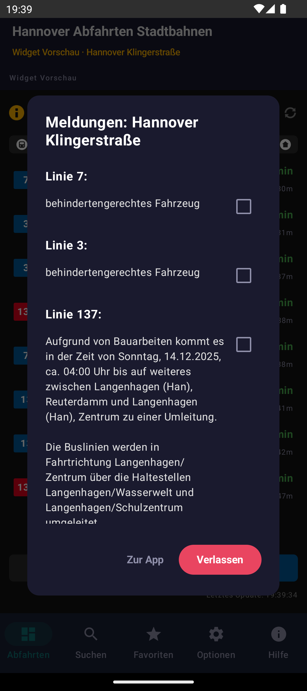
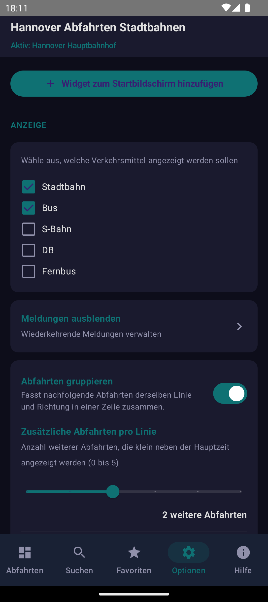

# Üstra Hannover - Abfahrten Widget

Ein modernes, natives Android-Widget für Live-Abfahrtszeiten des GVH (Großraum-Verkehr Hannover). Behalte Busse und Bahnen direkt auf deinem Homescreen im Blick.

## Features

- **Live-Abfahrten**: Echtzeitdaten für alle Stationen der ÜSTRA / GVH.
- **Intelligenter Filter**: Schnelles Umschalten zwischen Bus- und Stadtbahn-Ansicht mit eigens gestalteten Icons (Bus-Front im Kreis, Stadtbahn mit Lampen und Schienen).
- **Richtungsfilter**: Umschalten zwischen Stadteinwärts, Stadtauswärts und beiden Richtungen – mit eigenen Stadt-/Haus-Icons im Kreis-Badge-Stil.
- **GPS-Modus**: Findet automatisch die nächstgelegene Haltestelle in deiner Umgebung. Es wird bei jedem Datenabruf eine frische Position bestimmt, sodass die Anzeige der Station folgt, während du unterwegs bist.
- **Meldungen & Störungen**: Hinweise und Störungsmeldungen werden direkt am Widget angezeigt (HTML wird automatisch entfernt). Wiederkehrende Meldungen lassen sich ausblenden; wichtige (geschützte) Meldungen bleiben immer sichtbar.
- **Flexible Zeitanzeige**: Wechsel per Klick zwischen Minuten-Countdown (z.B. „5 Min") und Uhrzeit (z.B. „14:30").
- **Favoriten-Schnellwahl**: Tasten `1`, `2`, `3` und `▶` im Widget-Header wechseln direkt zu deinen gespeicherten Lieblingsstationen.
- **Favoritenverwaltung**: Beliebige Reihenfolge, eigene Alias-Namen (z.B. „Arbeit" oder „🏠 Zuhause").
- **Smart Refresh**: Automatischer Datenabruf beim Tippen auf Filterelemente. Daten werden höchstens einmal alle 60 Sekunden neu geladen – im GPS-Modus alle 30 Sekunden, damit die nächstgelegene Haltestelle aktuell bleibt.
- **Batterieschonend & Schnell**: Integrierte Caching-Logik und gezielte UI-Updates ohne unnötige Netzwerkaufrufe. Eine frische GPS-Position wird nur beim tatsächlichen Datenabruf angefordert.

## Screenshots

| Homescreen-Widget | Abfahrten (App) | Favoriten |
| --- | --- | --- |
|  |  |  |

| Suche | Meldungen | Optionen |
| --- | --- | --- |
|  |  |  |

## Bedienung & Tipps

- **`1` / `2` / `3` Buttons** im Header: Springt direkt zur 1., 2. oder 3. Favoritenstation.
- **`▶` Button** im Header: Wechselt zyklisch durch alle weiteren Favoriten (ab Platz 4).
- **Klick auf Stationsname**: Öffnet die Stations-Auswahlansicht in der App.
- **GPS-Icon**: Aktiviert/Deaktiviert die GPS-Suche. Beim Aktivieren wird sofort eine frische Position bestimmt und die nächstgelegene Haltestelle gesetzt.
- **Refresh-Icon**: Erzwingt ein sofortiges Update der Daten (im Hintergrund max. einmal alle 60 Sek., im GPS-Modus alle 30 Sek.).
- **Klick auf Bus/Bahn-Icon**: Filtert die Ansicht auf Busse, Bahnen oder alle Fahrzeuge.
- **Klick auf Richtungs-Icon**: Filtert nach Fahrtrichtung (stadteinwärts / stadtauswärts / beide).
- **`(i)`-Hinweise**: Zeigen Meldungen und Störungen zur Station an. Wiederkehrende Meldungen lassen sich in den App-Einstellungen ausblenden.

## Favoritenverwaltung (App)

Die App bietet eine vollständige Verwaltung deiner Lieblingshaltestellen:

- **Reihenfolge ändern**: Hoch- und Runter-Pfeile verschieben die Position in der Liste — und damit auch die Reihenfolge der Schnellwahl-Buttons.
- **Alias vergeben**: Gib einer Station einen eigenen Namen (z.B. „Arbeit"), der dann im Widget angezeigt wird.
- **Aktive Station**: Die derzeit angezeigte Station ist in der Liste mit „JETZT AKTIV" markiert.

## Meldungen verwalten (App)

- **Wiederkehrende Meldungen ausblenden**: Häufig auftauchende Hinweise (z.B. dauerhafte Umleitungen) lassen sich ausblenden. Die App lernt automatisch, welche Meldungen oft erscheinen, und bietet sie zur Ausblendung an.
- **Geschützte Meldungen**: Wichtige Meldungen sind geschützt und können nicht ausgeblendet werden – sie bleiben immer sichtbar.
- **Zurücksetzen**: Ausgeblendete Meldungen bleiben auch beim Zurücksetzen der übrigen Einstellungen erhalten.

## Technische Details

- **Sprache**: Kotlin
- **Framework**: Jetpack Compose mit Glance (für Widgets)
- **API**: ÜSTRA Web Proxy (EFA XML_DM_REQUEST)
- **Speicherung**: DataStore (Preferences & JSON) für Caching und Favoritenverwaltung mit automatischer Migration

---
*Hinweis: Dies ist ein inoffizielles Widget und steht in keiner direkten Verbindung zur ÜSTRA oder dem GVH.*

## Support & Spenden

Gefällt dir das Widget? Wenn du die Weiterentwicklung unterstützen möchtest, freue ich mich über einen virtuellen Kaffee! ☕

