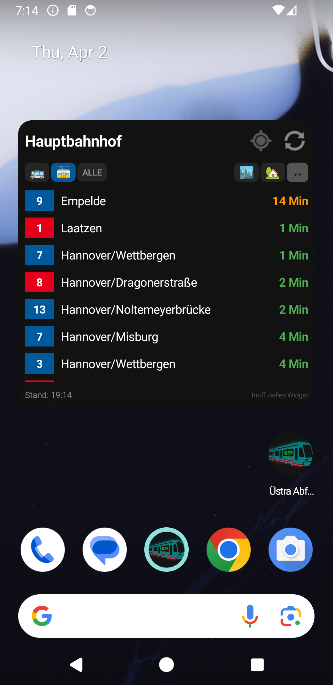
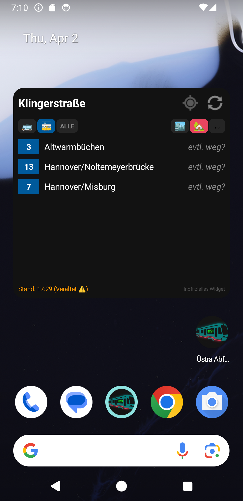
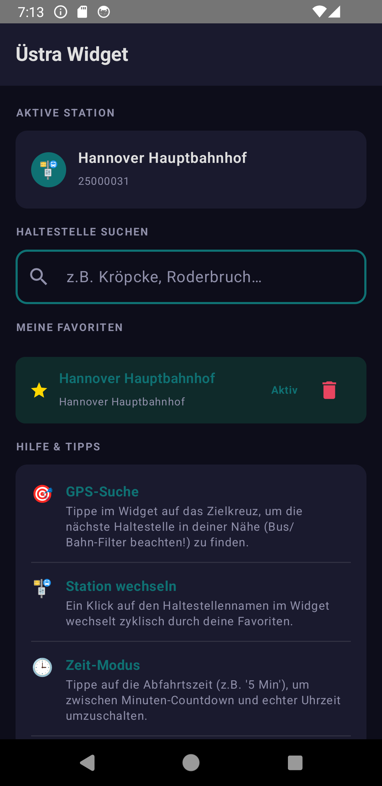

# Üstra Hannover - Abfahrten Widget

Ein modernes, natives Android-Widget für Live-Abfahrtszeiten des GVH (Großraum-Verkehr Hannover). Behalte Busse und Bahnen direkt auf deinem Homescreen im Blick.

## Features

- **Live-Abfahrten**: Echtzeitdaten für alle Stationen der ÜSTRA / GVH.
- **Intelligenter Filter**: Schnelles Umschalten zwischen Bus- und Stadtbahn-Ansicht mit klar erkennbaren Material-Icons.
- **Richtungsfilter**: Umschalten zwischen Stadteinwärts (🏙), Stadtauswärts (🏠) und beiden Richtungen.
- **GPS-Modus**: Findet automatisch die nächstgelegene Haltestelle in deiner Umgebung.
- **Flexible Zeitanzeige**: Wechsel per Klick zwischen Minuten-Countdown (z.B. „5 Min") und Uhrzeit (z.B. „14:30").
- **Favoriten-Schnellwahl**: Tasten `1`, `2`, `3` und `▶` im Widget-Header wechseln direkt zu deinen gespeicherten Lieblingsstationen.
- **Favoritenverwaltung**: Beliebige Reihenfolge, eigene Alias-Namen (z.B. „Arbeit" oder „🏠 Zuhause").
- **Smart Refresh**: Automatischer Datenabruf beim Tippen auf Filterelemente. Daten werden nie öfter als einmal alle 30 Sekunden neu geladen.
- **Batterieschonend & Schnell**: Integrierte Caching-Logik und gezielte UI-Updates ohne unnötige Netzwerkaufrufe.

## Screenshots

| Widget (Hauptbahnhof) | Widget (Klingerstraße) | App-Konfiguration |
| --- | --- | --- |
|  |  |  |

## Bedienung & Tipps

- **`1` / `2` / `3` Buttons** im Header: Springt direkt zur 1., 2. oder 3. Favoritenstation.
- **`▶` Button** im Header: Wechselt zyklisch durch alle weiteren Favoriten (ab Platz 4).
- **Klick auf Stationsname**: Öffnet die Stations-Auswahlansicht in der App.
- **GPS-Icon**: Aktiviert/Deaktiviert die GPS-Suche.
- **Refresh-Icon**: Erzwingt ein sofortiges Update der Daten (max. einmal alle 30 Sek.).
- **Klick auf Bus/Bahn-Icon**: Filtert die Ansicht auf Busse, Bahnen oder alle Fahrzeuge.
- **Klick auf Richtungs-Icon**: Filtert nach Fahrtrichtung (stadteinwärts / stadtauswärts / beide).

## Favoritenverwaltung (App)

Die App bietet eine vollständige Verwaltung deiner Lieblingshaltestellen:

- **Reihenfolge ändern**: Hoch- und Runter-Pfeile verschieben die Position in der Liste — und damit auch die Reihenfolge der Schnellwahl-Buttons.
- **Alias vergeben**: Gib einer Station einen eigenen Namen (z.B. „Arbeit"), der dann im Widget angezeigt wird.
- **Aktive Station**: Die derzeit angezeigte Station ist in der Liste mit „JETZT AKTIV" markiert.

## Technische Details

- **Sprache**: Kotlin
- **Framework**: Jetpack Compose mit Glance (für Widgets)
- **API**: ÜSTRA Web Proxy (EFA XML_DM_REQUEST)
- **Speicherung**: DataStore (Preferences & JSON) für Caching und Favoritenverwaltung mit automatischer Migration

---
*Hinweis: Dies ist ein inoffizielles Widget und steht in keiner direkten Verbindung zur ÜSTRA oder dem GVH.*
